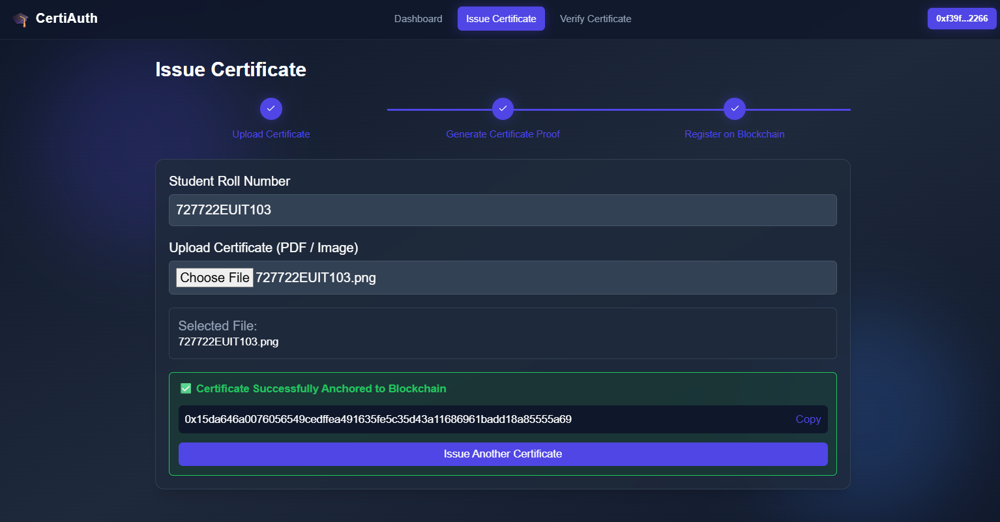
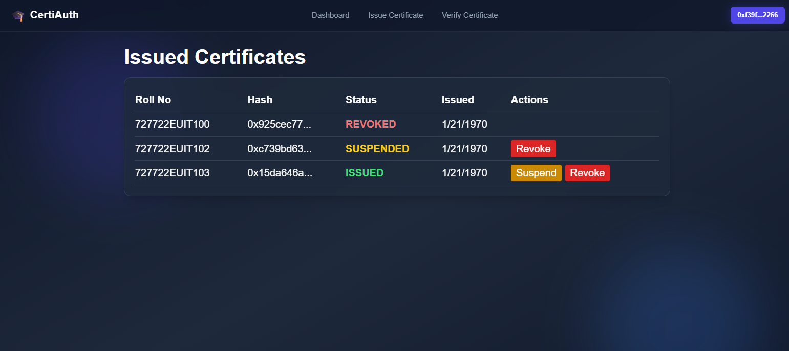
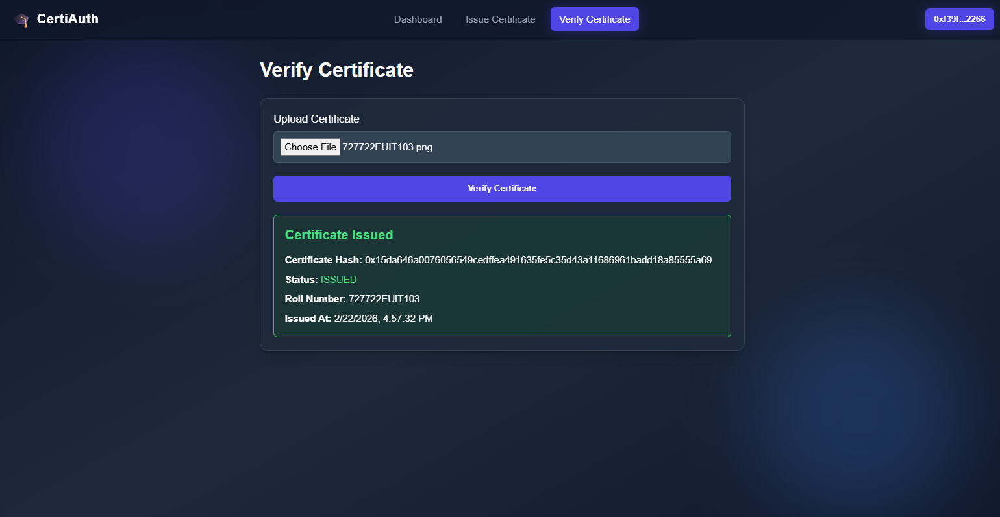
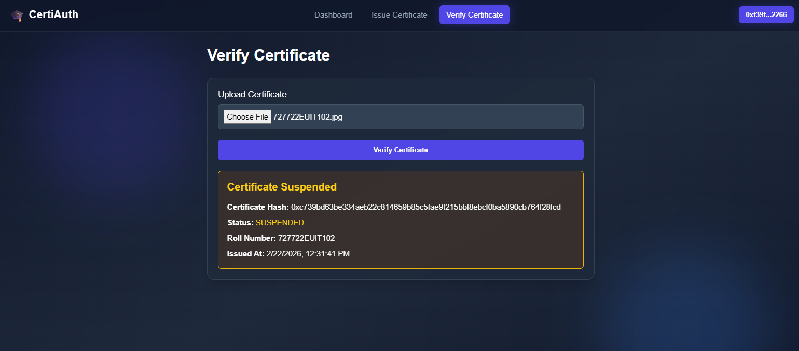
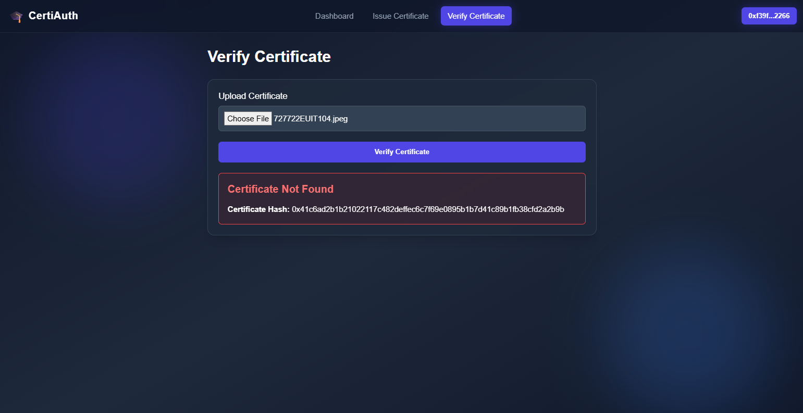

# CertiAuth: Blockchain-Based University Certificate Authentication & Fraud Prevention

**CertiAuth** is a blockchain-driven academic credential management platform designed to eliminate certificate forgery and streamline verification workflows. Utilizing a **dual-ledger architecture** (Private Governance Ledger + Public Registry Ledger) and **Keccak-256 cryptographic hashing**, the platform enables educational institutions to issue, manage, and verify academic certificates securely without exposing sensitive student data on public networks.

---

## Key Features

- **Dual-Ledger Architecture**: 
  - **Private Ledger (Governance)**: Manages complete certificate lifecycle operations (issuance, updates, suspension, revocation, reissuance).
  - **Public Ledger (Registry)**: Anchors immutable cryptographic proofs (certificate hash + timestamp) for public validation.
- **Tamper-Proof Verification**: Generates unique Keccak-256 digital signatures for documents; minor modifications cause complete hash mismatches.
- **Lifecycle Management**: Real-time status tracking (`ISSUED`, `SUSPENDED`, `REVOKED`) with automated smart contract logic.
- **Web3 / MetaMask Integration**: Role-based access control requiring cryptographic wallet signatures for institutional operations.
- **Instant Validation**: Verification complete in seconds via hash comparison or document upload, eliminating manual, multi-day university delays.

---

## Tech Stack

- **Frontend**: React.js, Tailwind CSS / Custom Components, Ethers.js
- **Smart Contracts & Blockchain**: Solidity (`^0.8.20`), Hardhat, Ethereum EVM
- **Backend Runtime**: Node.js, Express.js
- **Wallet Auth**: MetaMask

---

## System Architecture & Workflow

1. **Issuance**: University Admin connects an authorized Web3 wallet, uploads certificate details/PDF, and generates a Keccak-256 hash.
2. **Private Logging**: Full operational data and lifecycle state are recorded on the **Private Certificate Governance Contract**.
3. **Public Anchoring**: The certificate hash and timestamp are anchored to the **Public Certificate Registry Contract**.
4. **Verification**: Verifiers (Employers/Universities) re-compute the document hash on the verification portal. The system matches it against the public ledger anchor to confirm validity and status.

---

## Project Structure

## Project Structure

```text
├── Frontend/                           # Frontend React/UI application directory
├── blockchain/
│   ├── privateChain.js                 # Private chain interaction scripts
│   ├── publicChain.js                  # Public chain read interaction scripts
│   └── publicWrite.js                  # Public chain write interaction scripts
├── contracts/
│   ├── PrivateCertificateGovernance.sol # Private ledger contract for lifecycle management
│   └── PublicCertificateRegistry.sol   # Public ledger contract for immutable hash verification
├── dual-ledger/                        # Application Screenshot
├── routes/
│   ├── adminCertificates.js            # Admin certificate management API routes
│   ├── company.js                      # Verification routes for employers/verifiers
│   └── university.js                   # University issuance and management routes
├── scripts/
│   └── deploy.js                       # Contract deployment automation script
├── services/
│   └── ocrService.js                   # Optical Character Recognition processing service
├── test/                               # Automated test suites
├── utils/
│   ├── hashUtil.js                     # Keccak-256 cryptographic hashing helper utilities
│   └── statusMap.js                    # Certificate status mapping utilities (ISSUED, SUSPENDED, REVOKED)
└── README.md
```

---

## Getting Started

### Prerequisites

- [Node.js](https://nodejs.org/) (v16 or higher)
- [MetaMask Browser Extension](https://metamask.io/)
- npm / yarn

### Installation & Local Setup

1. **Clone the Repository**
   ```bash
   git clone 
   cd 
   ```

2. **Install Dependencies**
   ```bash
   npm install
   ```

3. **Run Local Blockchain Node**
   ```bash
   npx hardhat node
   ```

4. **Deploy Smart Contracts**
   In a new terminal:
   ```bash
   npx hardhat run scripts/deploy.js --network localhost
   ```

5. **Start the Application**
   ```bash
   npm start
   ```

---

## Application Screenshots

### 1. Dashboard


### 2. Wallet Connection


##### Next


### 3. Certificate Issuance Panel


### 4. Certificate Lifecycle Management


### 5. Valid Certificate Verification


### 6. Suspended Certificate Status


### 7. Revoked Certificate Status


### 8. Invalid Certificate

